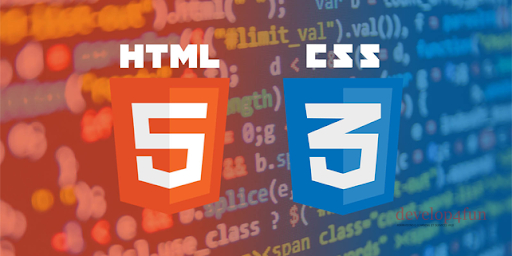

# Curso HTML & CSS de Jon Mircha
Hola amigos y amigas, este repo contiene los códigos asociados al curso de HTML y CSS impartido por el profesor Jonathan Mircha en su canal de [youtube](https://www.youtube.com/jonmircha). En él encontrarás elementos básicos que fortalecerán tus conocimientos para iniciarte en el mundo del diseño web. Suerte con ello :wink:  
[Enlace del curso](https://www.youtube.com/watch?v=-oK6zL01fNM&list=PLvq-jIkSeTUZYcX9SYwVe7f66afwd9qk_)  
[Sitio web del instructor](https://jonmircha.com/)  

 
   

# HTML->Qué es? :thinking:
HTML, siglas en inglés de HyperText Markup Language (‘lenguaje de marcado de hipertexto’), hace referencia al lenguaje de marcado para la elaboración de páginas web. Es un estándar que sirve de referencia del software que conecta con la elaboración de páginas web en sus diferentes versiones, define una estructura básica y un código (denominado código HTML) para la definición de contenido de una página web, como texto, imágenes, videos, juegos, entre otros. Es un estándar a cargo del World Wide Web Consortium (W3C) o Consorcio WWW, organización dedicada a la estandarización de casi todas las tecnologías ligadas a la web, sobre todo en lo referente a su escritura e interpretación.  

# CSS->Qué es? :thinking:  
CSS (siglas en inglés de Cascading Style Sheets), en español «Hojas de estilo en cascada», es un lenguaje de diseño gráfico para definir y crear la presentación de un documento estructurado escrito en un lenguaje de marcado. Es muy usado para establecer el diseño visual de los documentos web, e interfaces de usuario escritas en HTML o XHTML; el lenguaje puede ser aplicado a cualquier documento XML, incluyendo XHTML, SVG, XUL, RSS, etcétera. Junto con HTML y JavaScript, CSS es una tecnología usada por muchos sitios web para crear páginas visualmente atractivas, interfaces de usuario para aplicaciones web y GUIs para muchas aplicaciones móviles (como Firefox OS).  

# Aprender más sobre HTML & CSS  
?? ¿Deseas conocer más acerca de estos elementos?, te inivito a visitar los siguientes enlaces:  
[HTML documentación oficial](https://developer.mozilla.org/es/docs/Web/HTML)  
[CSS documentación oficial](https://developer.mozilla.org/es/docs/Web/CSS)  
En estos sitios encontrarás gran parte de lo que necesitas para iniciar en este maravilloso mundo del desarrollo web, y a modo general en la web te encontrarás con variados proyectos para practicar lo aprendido, espero te sea de ayuda este repo :wink:.
